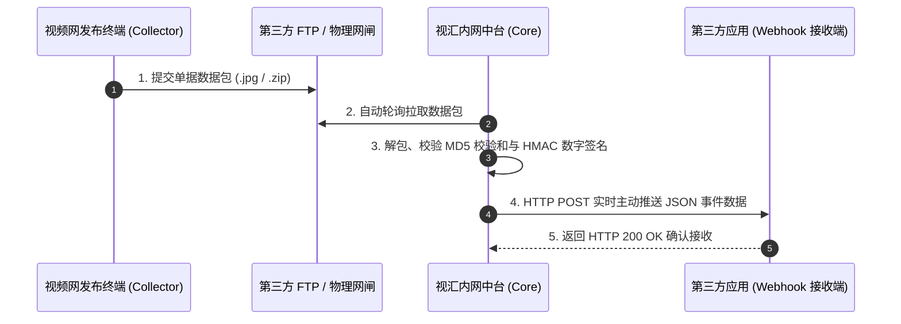

# 视汇 (VFusion) - 第三方应用 Webhook 主动推送对接说明文档

本文档旨在引导第三方系统（如 OA 系统、安防指挥平台、ERP、数据大屏等）通过 **Webhook 主动推送模式** 对接视汇 (VFusion) 内网数据汇聚与管理中台。

---

## 一、 整体对接架构与流程



当视汇内网数据中台从 FTP 或网闸拉取并成功解包、校验签名通过后，会**立即调用第三方系统预先注册的 HTTP/HTTPS Webhook 回调地址**，将包含单据元数据、业务负荷及凭证照片地址的标准 JSON 数据实时推送到第三方应用。

---

## 二、 接口交互规范

### 1. HTTP 请求基础配置
* **传输协议**：`HTTP` / `HTTPS`
* **请求方法**：`POST`
* **Content-Type**：`application/json; charset=utf-8`
* **默认超时**：`5000ms`（建议第三方接收端在收到请求后快速响应 HTTP 200，耗时耗时业务放入异步队列处理）
* **幂等处理**：第三方应用处理时，请以 `data.event_id` 或 `data.zip_hash` 作为唯一主键防重。

### 2. HTTP 请求 Header 规范

| Header 名称 | 类型 | 示例值 | 说明 |
| :--- | :--- | :--- | :--- |
| `Content-Type` | String | `application/json` | 规定消息体格式为 JSON |
| `Content-Length` | Number | `1024` | 消息体字节长度 |
| `X-VFusion-Signature` | String | `a1f8c...9e32` | 64 位 HMAC-SHA256 数字签名，用于验证消息来源防篡改 |

---

## 三、 推送数据结构 (JSON Payload)

内网中台每次推送的 Body 结构如下：

### 1. 完整 JSON 报文示例

```json
{
  "event": "EVENT_INGESTED",
  "timestamp": "2026-08-11T15:20:00.000Z",
  "data": {
    "id": 1786411062348,
    "app_id": "APP_SECURITY",
    "biz_type": "GATE_ACCESS",
    "event_id": "EVT_20260811_0001",
    "task_code": "TASK_BORDER_PATROL",
    "task_name": "厂区周界安防例行巡检",
    "timestamp": "2026-08-11T15:19:50.000Z",
    "submit_time": "2026-08-11T15:19:50.000Z",
    "operator": "张巡检 (operator_zhang)",
    "operator_username": "operator_zhang",
    "operator_name": "张巡检",
    "payload": {
      "location": "东门 1 号门闸",
      "description": "人员通行身份比对",
      "person_name": "李四",
      "person_id_card": "110101199003072345",
      "person_domicile": "北京市朝阳区"
    },
    "files": [
      {
        "filename": "001.jpg",
        "url": "/assets/tasks/TASK_BORDER_PATROL/EVT_20260811_0001/001.jpg"
      }
    ],
    "zip_hash": "a1b2c3d4e5f67890a1b2c3d4e5f67890",
    "signature": "64位HMAC数字签名字符串",
    "status": "RECEIVED",
    "created_at": "2026-08-11T15:20:00.000Z"
  }
}
```

### 2. 核心字段详细说明

| 字段节点 | 字段名 | 类型 | 说明 |
| :--- | :--- | :--- | :--- |
| 根节点 | `event` | String | 事件类型，固定为 `EVENT_INGESTED` |
| 根节点 | `timestamp` | String | 推送动作发生的时间戳 (ISO-8601) |
| `data` | `event_id` | String | **全局唯一单据/事件 ID**（全局幂等唯一标识） |
| `data` | `app_id` | String | 业务应用标识 |
| `data` | `biz_type` | String | 业务类型代码 |
| `data` | `task_code` | String | 任务编号/表单方案编码 |
| `data` | `task_name` | String | 任务名称 |
| `data` | `operator_username` | String | 提交人用户名 |
| `data` | `operator_name` | String | 提交人姓名 |
| `data` | `payload` | Object | **动态表单键值对内容**（包含自定义业务表单字段、涉事人员信息等） |
| `data` | `files` | Array | 现场照片与凭证附件相对路径列表 |
| `files[i]` | `filename` | String | 照片原始文件名（如 `001.jpg`） |
| `files[i]` | `url` | String | 照片 HTTP 访问相对路径（拼接内网中台地址即可下载/展示） |
| `data` | `signature` | String | HMAC 防篡改数字签名 |

---

## 四、 第三方接入与签名验伪机制

为了防止未经授权的恶意 POST 请求伪造数据，第三方接收端可在收到请求时，验证 Header 中的 `X-VFusion-Signature`：

### HMAC-SHA256 签名校验算法
1. 取出请求 Header `X-VFusion-Signature`。
2. 校验其值是否与 `data.signature` 一致。
3. 可使用 shared HMAC key 对单据信息进行重计算校验：

$$\text{Signature} = \text{HMAC-SHA256}(\text{app\_id} + \text{biz\_type} + \text{event\_id} + \text{timestamp} + \text{JSON(payload)}, \text{HMAC\_SECRET})$$

---

## 五、 第三方应用接收端代码示例

### 1. Node.js (Express) 对接示例

```javascript
const express = require('express');
const app = express();
app.use(express.json());

// 第三方应用 Webhook 接收端接口
app.post('/api/vfusion/callback', (req, res) => {
  const { event, data } = req.body;
  const signature = req.headers['x-vfusion-signature'];

  console.log(`[Webhook 收到新单据] Event: ${event}, EventID: ${data?.event_id}`);
  console.log(`- 提交人: ${data?.operator_name} (${data?.operator_username})`);
  console.log(`- 业务负荷:`, data?.payload);
  console.log(`- 照片附件数:`, data?.files?.length || 0);

  // 1. 幂等防重检查（示例）
  // if (db.hasProcessed(data.event_id)) return res.json({ status: 'ALREADY_PROCESSED' });

  // 2. 照片完整 URL 拼接 (内网中台地址默认端口 5002)
  const coreBaseUrl = 'http://192.168.1.100:5002'; // 修改为实际视汇内网中台 IP
  if (data?.files) {
    data.files.forEach(f => {
      console.log(`- 照片完整下载 URL: ${coreBaseUrl}${f.url}`);
    });
  }

  // 3. 返回 200 OK 确认接收
  res.json({ success: true, message: '单据回调接收成功' });
});

app.listen(8080, () => console.log('第三方应用 Webhook 接收端已启动，监听端口 8080'));
```

### 2. Java (Spring Boot) 对接示例

```java
@RestController
@RequestMapping("/api/vfusion")
public class VFusionWebhookController {

    @PostMapping("/callback")
    public ResponseEntity<Map<String, Object>> handleVFusionEvent(
            @RequestHeader(value = "X-VFusion-Signature", required = false) String signature,
            @RequestBody Map<String, Object> body) {
        
        String event = (String) body.get("event");
        Map<String, Object> data = (Map<String, Object>) body.get("data");
        
        String eventId = (String) data.get("event_id");
        String taskName = (String) data.get("task_name");
        Map<String, Object> payload = (Map<String, Object>) data.get("payload");

        System.out.println("收到视汇主动推送单据, EventID: " + eventId + ", 任务: " + taskName);
        System.out.println("业务负荷内容: " + payload);

        // 返回成功给视汇内网中台
        Map<String, Object> response = new HashMap<>();
        response.put("success", true);
        response.put("message", "单据入库成功");
        return ResponseEntity.ok(response);
    }
}
```

### 3. Python (FastAPI / Flask) 对接示例

```python
from flask import Flask, request, jsonify

app = Flask(__name__)

@app.route('/api/vfusion/callback', methods=['POST'])
def vfusion_callback():
    sig = request.headers.get('X-VFusion-Signature')
    body = request.get_json()
    
    event_data = body.get('data', {})
    event_id = event_data.get('event_id')
    payload = event_data.get('payload', {})
    
    print(f"[VFusion 推送] 收到单据 {event_id}, 内容: {payload}")
    
    return jsonify({"success": True, "message": "Received successfully"}), 200

if __name__ == '__main__':
    app.run(host='0.0.0.0', port=8080)
```

---

## 六、 在视汇控制台中配置 Webhook 节点

1. **登录内网数据中台**（浏览器访问 `http://<内网中台IP>:5002`，使用管理员账号登录）。
2. 在左侧菜单进入 **【 Webhook 分发与订阅】** 页面。
3. 点击右上角 **【新增 Webhook 节点】**。
4. 在弹出的对话框中输入：
   * **Webhook 名称**：例如 `生产环境 OA 系统对接节点`
   * **回调 URL 地址**：例如 `http://192.168.1.50:8080/api/vfusion/callback`
   * **功能开关**：启用
5. 保存后可点击 **【发送测试 Payload】** 验证连通性。

---

## 七、 常见问题排查

1. **内网中台提示消息分发失败**：
   * 检查第三方接收端服务是否启动，防火墙是否放行了对应端口。
   * 检查回调 URL 是否填写正确（确保内网中台机器能够 Ping 通第三方 IP）。
2. **凭证照片如何访问与展示**：
   * `files[i].url` 返回的是相对路径，例如 `/assets/tasks/TASK_001/EVT_001/001.jpg`。
   * 在第三方前端页面展示时，拼接视汇内网中台地址即可：`http://<内网中台IP>:5002/assets/tasks/TASK_001/EVT_001/001.jpg`。
