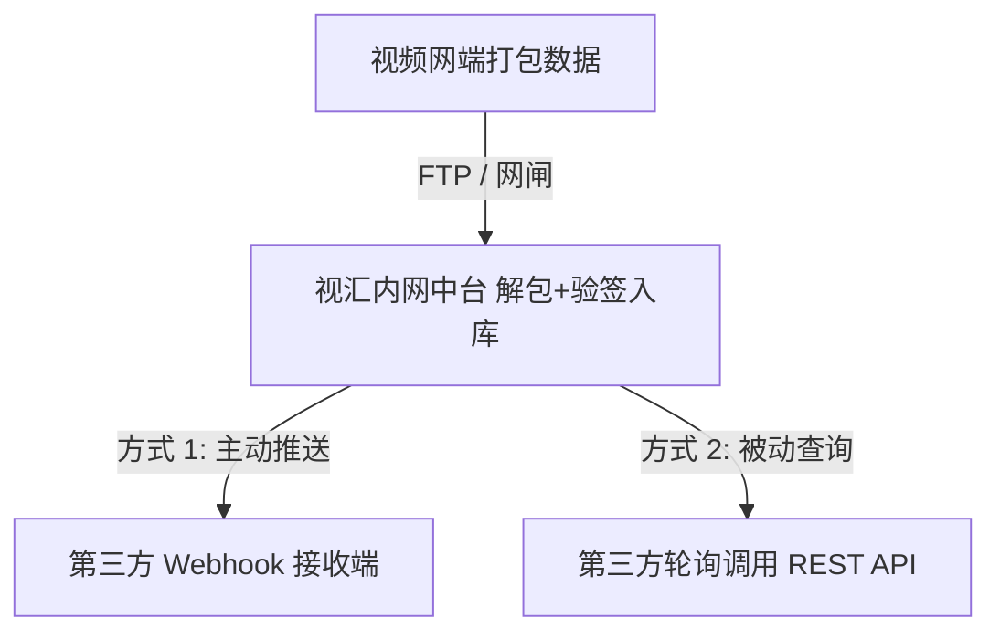

# 视汇 (VFusion) - 第三方应用系统对接说明文档

本文档旨在指引第三方系统（如 OA 系统、安防指挥平台、ERP、数据大屏、数据仓库等）对接视汇 (VFusion) 内网数据中台。视汇提供 **模式一：主动推送模式 (Webhook)** 与 **模式二：被动拉取模式 (REST API)** 两种标准对接方案。

---

## 目录
- [一、 对接模式概述与选择建议](#一-对接模式概述与选择建议)
- [二、 模式一：主动推送模式 (Webhook 回调)](#二-模式一主动推送模式-webhook-回调)
  - [1. 接口交互规范](#1-接口交互规范)
  - [2. 推送数据结构 (JSON Payload)](#2-推送数据结构-json-payload)
  - [3. HMAC 数字签名验伪校验](#3-hmac-数字签名验伪校验)
  - [4. Webhook 接收端代码示例 (Node.js / Java / Python)](#4-webhook-接收端代码示例-nodejs--java--python)
  - [5. 在视汇控制台中配置 Webhook 节点](#5-在视汇控制台中配置-webhook-节点)
- [三、 模式二：被动拉取模式 (REST API 查询)](#三-模式二被动拉取模式-rest-api-查询)
  - [1. 认证与鉴权方式](#1-认证与鉴权方式)
  - [2. REST API 接口详细规范](#2-rest-api-接口详细规范)
  - [3. 被动轮询/拉取代码示例 (Python / Java / Node.js)](#3-被动轮询拉取代码示例-python--java--nodejs)
- [四、 常见问题排查 (FAQ)](#四-常见问题排查-faq)

---

## 一、 对接模式概述与选择建议



### 对接模式对比表

| 对接模式 | 触发机制 | 实时性 | 适用场景 | 架构要求 |
| :--- | :--- | :--- | :--- | :--- |
| **模式一：主动推送 (Webhook)** | **事件驱动**<br>视汇解包入库后实时 HTTP POST 回调 | **高 (毫秒级)** | 实时告警响应、消息推送、工作流审批、实时数据联动 | 第三方系统需暴露一个 HTTP/HTTPS 接收端口供视汇调用 |
| **模式二：被动拉取 (REST API)** | **轮询/定时驱动**<br>第三方主动调用视汇 REST API | **按需/分钟级** | 数据大屏、数据仓库定时 ETL、防火墙隔离无法被回调的系统 | 第三方主动请求视汇内网中台（默认端口 `5002`） |

---

## 二、 模式一：主动推送模式 (Webhook 回调)

当视汇内网数据中台从 FTP 或网闸拉取并成功解包、校验签名通过后，会**立即调用第三方系统预先注册的 HTTP/HTTPS Webhook 回调地址**。

### 1. 接口交互规范
* **请求方法**：`POST`
* **Content-Type**：`application/json; charset=utf-8`
* **默认超时**：`5000ms`（建议第三方接收端收到后快速响应 HTTP 200，耗时逻辑异步处理）
* **Header 规范**：
  * `Content-Type`: `application/json`
  * `X-VFusion-Signature`: 64 位 HMAC-SHA256 数字签名字符串

### 2. 推送数据结构 (JSON Payload)

```json
{
  "event": "EVENT_INGESTED",
  "timestamp": "2026-08-11T15:20:00.000Z",
  "data": {
    "id": 1786411062348,
    "app_id": "APP_SECURITY",
    "biz_type": "GATE_ACCESS",
    "event_id": "EVT_20260811_0001",
    "task_code": "TASK_BORDER_PATROL",
    "task_name": "厂区周界安防例行巡检",
    "submit_time": "2026-08-11T15:19:50.000Z",
    "operator_username": "operator_zhang",
    "operator_name": "张巡检",
    "payload": {
      "location": "东门 1 号门闸",
      "description": "人员通行身份比对",
      "person_name": "李四",
      "person_id_card": "110101199003072345"
    },
    "files": [
      {
        "filename": "001.jpg",
        "url": "/assets/tasks/TASK_BORDER_PATROL/EVT_20260811_0001/001.jpg"
      }
    ],
    "zip_hash": "a1b2c3d4e5f67890a1b2c3d4e5f67890",
    "signature": "64位HMAC数字签名字符串",
    "status": "RECEIVED",
    "created_at": "2026-08-11T15:20:00.000Z"
  }
}
```

### 3. HMAC 数字签名验伪校验
第三方可在 Header 中提取 `X-VFusion-Signature`，并用双方约定的 HMAC 密钥验证消息来源防篡改。

### 4. Webhook 接收端代码示例 (Node.js / Java / Python)

#### Node.js (Express)
```javascript
const express = require('express');
const app = express();
app.use(express.json());

app.post('/api/vfusion/callback', (req, res) => {
  const { event, data } = req.body;
  console.log(`[Webhook 收到单据] ID: ${data?.event_id}, 提交人: ${data?.operator_name}`);
  res.json({ success: true, message: '接收成功' });
});

app.listen(8080, () => console.log('Webhook 接收服务已启动端口 8080'));
```

#### Java (Spring Boot)
```java
@RestController
@RequestMapping("/api/vfusion")
public class WebhookController {
    @PostMapping("/callback")
    public ResponseEntity<Map<String, Object>> receiveEvent(@RequestBody Map<String, Object> body) {
        Map<String, Object> data = (Map<String, Object>) body.get("data");
        System.out.println("收到单据: " + data.get("event_id"));
        Map<String, Object> res = new HashMap<>();
        res.put("success", true);
        return ResponseEntity.ok(res);
    }
}
```

#### Python (Flask)
```python
from flask import Flask, request, jsonify
app = Flask(__name__)

@app.route('/api/vfusion/callback', methods=['POST'])
def callback():
    data = request.get_json().get('data', {})
    print(f"收到单据: {data.get('event_id')}")
    return jsonify({"success": True}), 200

if __name__ == '__main__':
    app.run(port=8080)
```

### 5. 在视汇控制台中配置 Webhook 节点
1. 登录内网数据中台 (`http://<中台IP>:5002`)；
2. 进入【Webhook 分发与订阅】页面，添加回调 URL 地址并保存。

---

## 三、 模式二：被动拉取模式 (REST API 查询)

如果第三方应用无法暴露 Webhook 端口或需要定期批量同步数据，可以采用被动拉取模式直接调用视汇内网中台的 REST API 接口。

### 1. 认证与鉴权方式
内网中台使用 Bearer Token 鉴权：调用登录接口获取 Token 后，请求 Header 带上：
  `Authorization: Bearer <your_jwt_token>`
图片资产同样受保护。登录后调用 `/api/auth/asset-token` 获取短期资产 Token，再将其作为 `?access_token=<asset_token>` 传给 `/assets/...` 或 `/collector-assets/...`；不要把长期 API Token 放入图片 URL。服务端还会再次校验图片所属任务的访问权限。

---

### 2. REST API 接口详细规范

#### (0) 离线监控点位主数据接口
* **请求路径**：`GET /api/monitoring-points`
* **Query 参数**：`query` 关键词（可选）、`page` 页码（默认 `1`）、`limit` 每页条数（默认 `30`，最大 `100`）。
* **用途**：分页返回启用监控点位及其 `point_id`、`name`、`location`、`longitude`、`latitude`，供采集表单或第三方系统选择标准坐标；经纬度可以为空。
* **说明**：点位数据由管理员根据现场测绘、设备台账或业务核准结果维护，接口不访问互联网地图服务。登录用户也可以通过 `POST /api/monitoring-points` 新增点位，未提供 `point_id` 时由系统自动生成。管理员维护接口为 `PUT /api/monitoring-points/:point_id`、`PATCH /api/monitoring-points/:point_id/toggle`、`POST /api/monitoring-points/import`、`GET /api/monitoring-points/export`。

#### (1) 登录鉴权接口
* **请求路径**：`POST /api/auth/login`
* **请求 Body**：
  ```json
  { "username": "admin", "password": "your_password" }
  ```
* **响应示例**：
  ```json
  {
    "success": true,
    "token": "eyJhbGciOiJIUzI1NiIsIn...",
    "user": { "username": "admin", "role": "admin" }
  }
  ```

#### (2) 批量查询/检索单据列表接口
* **请求路径**：`GET /api/events`
* **Query 参数**：
  * `page`: 页码（从 1 开始，默认 `1`）
  * `limit`: 每页条数（默认 `20`，最大 `100`）
  * `keyword`: 模糊检索关键字（支持匹配 `task_name`、`event_id`、`operator_name`、`payload` 内容等）
  * `app_id`: 筛选应用标识
  * `biz_type`: 筛选业务类型代码
* **响应示例**：
  ```json
  {
    "success": true,
    "total": 42,
    "page": 1,
    "limit": 20,
    "data": [
      {
        "id": 1786411062348,
        "app_id": "APP_SECURITY",
        "biz_type": "GATE_ACCESS",
        "event_id": "EVT_20260811_0001",
        "task_code": "TASK_BORDER_PATROL",
        "task_name": "厂区周界安防例行巡检",
        "timestamp": "2026-08-11T15:19:50.000Z",
        "submit_time": "2026-08-11T15:19:50.000Z",
        "operator_username": "operator_zhang",
        "operator_name": "张巡检",
        "payload": {
          "location": "东门 1 号门闸",
          "description": "人员通行身份比对",
          "person_name": "李四",
          "person_id_card": "110101199003072345"
        },
        "files": [
          {
            "filename": "001.jpg",
            "url": "/assets/tasks/TASK_BORDER_PATROL/EVT_20260811_0001/001.jpg"
          }
        ],
        "zip_hash": "a1b2c3d4e5f67890a1b2c3d4e5f67890",
        "signature": "64位HMAC数字签名字符串",
        "status": "RECEIVED",
        "created_at": "2026-08-11T15:20:00.000Z"
      }
    ]
  }
  ```

#### (3) 获取单条单据详情接口
* **请求路径**：`GET /api/events/:eventId`
* **路径参数**：`eventId` (如 `EVT_20260811_0001`)
* **响应说明**：返回该单据的完整 JSON 元数据及对应附件路径。

#### (4) 获取解包归档的照片/凭证附件
* **请求路径**：`GET /assets/tasks/{taskCode}/{eventId}/{filename}`
* **说明**：直接拼接中台地址展示/下载原始凭证照片：
  例如 `http://192.168.1.100:5002/assets/tasks/TASK_BORDER_PATROL/EVT_20260811_0001/001.jpg`

#### (5) 检索涉事人员库接口
* **请求路径**：`GET /api/personnel`
* **Query 参数**：`keyword`（匹配姓名或身份证号）
* **响应说明**：获取自动归档提取的涉事人员档案列表。

---

### 3. 被动轮询/拉取代码示例 (Python / Java / Node.js)

#### Python (Requests) 被动拉取示例
```python
import os
import requests
import time

CORE_URL = "http://192.168.1.100:5002"
USERNAME = "admin"
PASSWORD = os.environ["VFUSION_ADMIN_PASSWORD"]

def fetch_latest_events():
    session = requests.Session()
    # 1. 登录获取 Token
    login_res = session.post(f"{CORE_URL}/api/auth/login", json={"username": USERNAME, "password": PASSWORD})
    token = login_res.json().get("token")
    headers = {"Authorization": f"Bearer {token}"}

    # 2. 调用 GET /api/events 查询最新单据
    res = session.get(f"{CORE_URL}/api/events?limit=10", headers=headers)
    events = res.json().get("data", [])
    
    print(f"成功拉取到 {len(events)} 条最新单据:")
    for ev in events:
        print(f" - 单据ID: {ev['event_id']}, 任务: {ev['task_name']}, 提交人: {ev['operator_name']}")
        for f in ev.get("files", []):
            print(f"   图片地址: {CORE_URL}{f['url']} (下载时复用 headers)")

if __name__ == "__main__":
    fetch_latest_events()
```

#### Java (RestTemplate) 被动拉取示例
```java
public class VFusionClient {
    private static final String CORE_URL = "http://192.168.1.100:5002";

    public static void pullEvents() {
        RestTemplate restTemplate = new RestTemplate();
        
        // 1. 登录获取 Token
        Map<String, String> loginReq = new HashMap<>();
        loginReq.put("username", "admin");
        loginReq.put("password", System.getenv("VFUSION_ADMIN_PASSWORD"));
        Map<String, Object> loginRes = restTemplate.postForObject(CORE_URL + "/api/auth/login", loginReq, Map.class);
        String token = (String) loginRes.get("token");

        // 2. 带 Token 查询事件
        HttpHeaders headers = new HttpHeaders();
        headers.setBearerAuth(token);
        HttpEntity<Void> entity = new HttpEntity<>(headers);

        ResponseEntity<Map> response = restTemplate.exchange(
            CORE_URL + "/api/events?limit=20",
            HttpMethod.GET,
            entity,
            Map.class
        );

        List<Map<String, Object>> events = (List<Map<String, Object>>) response.getBody().get("data");
        System.out.println("成功拉取到单据数量: " + events.size());
    }
}
```

---

## 四、 常见问题排查 (FAQ)

1. **接口返回 401 Unauthorized**：
   * 请检查 Header 是否包含了正确的 `Authorization: Bearer <token>`，并确认 Token 未过期。
2. **凭证照片 `files[i].url` 如何在第三方网页展示**：
   * `url` 为相对路径（如 `/assets/tasks/...`），在第三方系统中展示时拼接视汇中台 IP 及端口，并通过 `Authorization` Header 访问；若必须使用 ``，追加 `?access_token=<token>`。
3. **数据大屏定时拉取频率**：
   * 建议轮询间隔设置为 5秒 ~ 30秒，视汇中台提供了高效的缓存与索引机制，支持高并发拉取。
